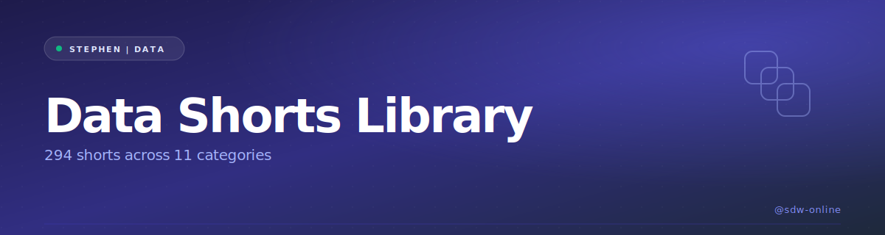
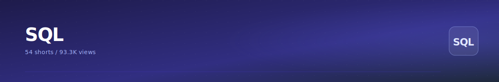
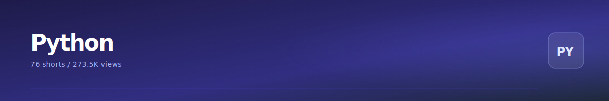
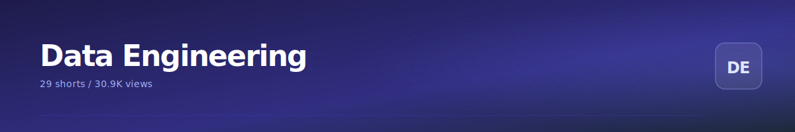
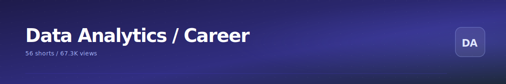
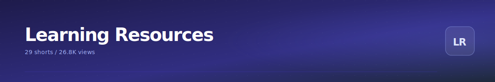

  

> Every data short I've made, sorted by what landed hardest. 294 shorts across 11 categories.

**SQL** - 29 shorts / 70.5K total views

<table>
<tr>
<td>
   
  <b>Use INNER JOINs in SQL to combine multiple tables to show only the records that match in both tables</b> 23K views
</td>
<td>
   
  <b>Use the COUNT function in SQL to calculate the total number of records from a SQL table #dataanalysi</b> 10K views
</td>
<td>
   
  <b>3 websites to learn SQL for FREE</b> 7.4K views
</td>
</tr>
<tr>
<td>
   
  <b>4 online games for data analysts:
 
 1. Datalyze
 2. Data Literacy
 3. SQL Murder Mystery
 4. DataWa</b> 3K views
</td>
<td>
   
  <b>5 places to learn SQL for FREE: 1</b> 2.8K views
</td>
</tr>
</table>

[Browse all 29 ->](./categories/sql.md)

**Excel** - 27 shorts / 42.3K total views

<table>
<tr>
<td>
   
  <b>5 websites to practice Excel online for FREE: 1</b> 9.9K views
</td>
<td>
   
  <b>Learn how to select cells, columns, rows and ranges in Excel with this simple video tutorial</b> 6.8K views
</td>
<td>
   
  <b>5 websites to practice Excel online for FREE:  1</b> 4.1K views
</td>
</tr>
<tr>
<td>
   
  <b>Websites to practice Excel, SQL and Power BI for FREE: 1</b> 2.5K views
</td>
<td>
   
  <b>30 Day Excel Challenge NOW ON YOUTUBE  YouTube: Stephen | Data</b> 1.6K views
</td>
</tr>
</table>

[Browse all 27 ->](./categories/excel.md)

**Python** - 44 shorts / 147K total views

<table>
<tr>
<td>
   
  <b>Object Oriented Programming in Python #programming #OOP #python</b> 82K views
</td>
<td>
   
  <b>Use Airflow to automate, schedule and orchestrate your Python-based workflows and scripts</b> 12K views
</td>
<td>
   
  <b>SOLID principles with Python |  #programming #python #coding</b> 9.4K views
</td>
</tr>
<tr>
<td>
   
  <b>Use list comprehensions to perform simple filtering operations instead of "if" statements in Python</b> 4.2K views
</td>
<td>
   
  <b>5 places to learn Python for FREE online #dataanlysis #datascience #dataengineering</b> 3K views
</td>
</tr>
</table>

[Browse all 44 ->](./categories/python.md)

**Data Engineering** - 12 shorts / 7.4K total views

<table>
<tr>
<td>
   
  <b>Here's a quick guide on how to install Airflow to your local environment</b> 2K views
</td>
<td>
   
  <b>What is data analytics?
 
 Why do companies need 
 
 - data analysts
 - data engineers 
 - data scie</b> 1K views
</td>
<td>
   
  <b>5 websites to learn Docker for FREE: 1</b> 812 views
</td>
</tr>
<tr>
<td>
   
  <b>Things data engineers hate to hear... What else belongs on this list?</b> 773 views
</td>
<td>
   
  <b>Data engineering videos on YouTube to help you: 1</b> 751 views
</td>
</tr>
</table>

[Browse all 12 ->](./categories/data-engineering.md)

**Data Analytics / Career** - 31 shorts / 18.9K total views

<table>
<tr>
<td>
   
  <b>5 websites to find medical datasets for your data analysis project: 1</b> 3K views
</td>
<td>
   
  <b>Should we learn and build data skills together...instead of by ourselves only?</b> 1.6K views
</td>
<td>
   
  <b>4 websites with environmental data for data analysis/science projects: 1</b> 1.5K views
</td>
</tr>
<tr>
<td>
   
  <b>How to become a data analyst: the roadmap: Learn these: 1</b> 1.4K views
</td>
<td>
   
  <b>25 things to do before 2025 ends (for your data career)</b> 1K views
</td>
</tr>
</table>

[Browse all 31 ->](./categories/data-analytics-career.md)

**Power BI / Tableau** - 2 shorts / 904 total views

<table>
<tr>
<td>
   
  <b>5 Power BI concepts used for data visualization and analysis: 1</b> 700 views
</td>
<td>
   
  <b>Use Tableau visual vocabulary to know what data visuals to use for which situations for your data</b> 204 views
</td>
</tr>
</table>

[Browse all 2 ->](./categories/power-bi-tableau.md)

**Normalisation / DB Design** - 7 shorts / 22.9K total views

<table>
<tr>
<td>
   
  <b>What is normalization in data engineering? 
 
 Why do we need this for designing databases and table</b> 8.3K views
</td>
<td>
   
  <b>What is Third Normal Form (3NF) in normalization? #dataanalytics #dataengineering #sql</b> 7.6K views
</td>
<td>
   
  <b>What is First Normal Form (1NF) in normalization ? 
 
 #dataanalytics #dataengineering #sql</b> 3.1K views
</td>
</tr>
<tr>
<td>
   
  <b>What is Second Normal Form (2NF) in normalization? 
 
 #dataanalytics #dataengineering #sql</b> 2.3K views
</td>
<td>
   
  <b>6 popular data warehouse tools in data engineering: 1</b> 876 views
</td>
</tr>
</table>

[Browse all 7 ->](./categories/normalisation-db-design.md)

**Interview Prep** - 18 shorts / 14.9K total views

<table>
<tr>
<td>
   
  <b>SQL interview question: Calculate the total salary for each department.
 
 #sql #dataanalytics #d</b> 2.5K views
</td>
<td>
   
  <b>SQL interview question: Increase the salary of all employees in department 2 by 5%.
 
 #sql #data</b> 1.4K views
</td>
<td>
   
  <b>SQL interview question: Filter the data to find employees who work in department_id = 4  
 
 #sql</b> 1.4K views
</td>
</tr>
<tr>
<td>
   
  <b>SQL interview question: Retrieve the top 5 highest salaries using the RANK() function. 
 
 #sql #</b> 1.3K views
</td>
<td>
   
  <b>SQL interview question: Retrieve the 4th highest salary using a window function 
 
 #sql #dataana</b> 1.3K views
</td>
</tr>
</table>

[Browse all 18 ->](./categories/interview-prep.md)

**Learning Resources** - 74 shorts / 91.3K total views

<table>
<tr>
<td>
   
  <b>YouTube channels for data analysts</b> 18K views
</td>
<td>
   
  <b>3 YouTube channels that show you everything you need to know about becoming a data analyst: 1</b> 3.3K views
</td>
<td>
   
  <b>6 YouTube channels to learn Excel, SQL and Python for beginners: 1</b> 2.9K views
</td>
</tr>
<tr>
<td>
   
  <b>Let's practice Excel for 30 days each day!  Subscribe to my YouTube channel to see when I</b> 2.5K views
</td>
<td>
   
  <b>Learn how to become  a data analyst in 2026 with YouTube  #excel #sql #powerbi #tableau #dataana</b> 2.4K views
</td>
</tr>
</table>

[Browse all 74 ->](./categories/learning-resources.md)

**Motivation / Mindset** - 8 shorts / 5.2K total views

<table>
<tr>
<td>
   
  <b>Anything is possible if you truly believe it</b> 1.6K views
</td>
<td>
   
  <b>2025 Wrapped</b> 1.2K views
</td>
<td>
   
  <b>Use the open close principle (from SOLID principles) to create code based the are open for extension</b> 824 views
</td>
</tr>
<tr>
<td>
   
  <b>Use the Liskov substitution principle (from SOLID principles) to design your code in a way the child</b> 554 views
</td>
<td>
   
  <b>How to achieve your goals this year</b> 446 views
</td>
</tr>
</table>

[Browse all 8 ->](./categories/motivation-mindset.md)

**Other** - 42 shorts / 35.5K total views

<table>
<tr>
<td>
   
  <b>Use SOAP APIs (Simple Object Access Protocol) to exchange sensitive information via a standardized X</b> 4.5K views
</td>
<td>
   
  <b>5 popular data visualization tools used in tech: 1</b> 2.7K views
</td>
<td>
   
  <b>5 websites to learn R for FREE: 1</b> 2.6K views
</td>
</tr>
<tr>
<td>
   
  <b>How the 1% win jobs/interviews in the tech market #dataengineering #dataanlysis #datascience</b> 2.1K views
</td>
<td>
   
  <b>Pains of debugging in programming  Programming is not for the weak hearted - you'll probably spend</b> 2.1K views
</td>
</tr>
</table>

[Browse all 42 ->](./categories/other.md)

## About

Cross-promo: [30 Day SQL Challenge](https://github.com/sdw-online/30-Day-SQL-Challenge) - [30 Day Excel Challenge](https://github.com/sdw-online/30-Day-Excel-Challenge) - [Portfolio](https://github.com/sdw-online/Data-Projects-Portfolio) - [YouTube channel](https://www.youtube.com/@sdw-online).

  

