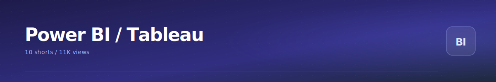

  

# Power BI / Tableau

10 shorts. BI tooling, dashboard design, viz comparisons.

<table>
<tr>
<td>
   
  <b>5 popular data visualization tools used in tech: 1</b> 2.7K views
</td>
<td>
   
  <b>5 websites with awesome data visualizations: 1</b> 1.6K views
</td>
<td>
   
  <b>5 YouTube channels to learn Power BI from: 1</b> 1.5K views
</td>
</tr>
<tr>
<td>
   
  <b>Learn Power BI on YouTube</b> 1.1K views
</td>
<td>
   
  <b>4 YouTube channels to learn Tableau as a beginner: 1</b> 1.1K views
</td>
<td>
   
  <b>3 YouTube channels to learn Power BI from beginner to pro level: 1</b> 962 views
</td>
</tr>
<tr>
<td>
   
  <b>4 YouTube channels to learn Power BI from: 1</b> 930 views
</td>
<td>
   
  <b>5 Power BI concepts used for data visualization and analysis: 1</b> 700 views
</td>
<td>
   
  <b>Learn Power BI with these online resources: Microsoft Learn: Power BI How To Power BI</b> 232 views
</td>
</tr>
<tr>
<td>
   
  <b>Use Tableau visual vocabulary to know what data visuals to use for which situations for your data</b> 204 views
</td>
</tr>
</table>
## Related categories

- [Excel](./excel.md) - Lookups, pivots, formulas, productivity.
- [Data Analytics / Career](./data-analytics-career.md) - Datasets, career advice, market context, role transitions.
- [Learning Resources](./learning-resources.md) - Curated lists: free sites, channels, courses, books.

[<- Back to library](../README.md)
